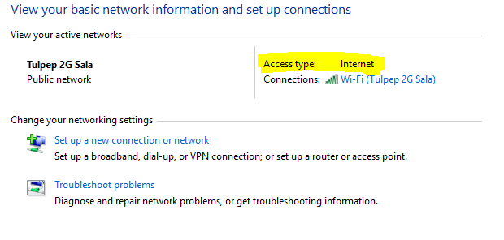

Internet Simulator [](https://ci.appveyor.com/project/tulpep/InternetSimulator)
===========

###A very simple utily to fully simulate an Internet Connection and make Windows think it is connected


##[Download now](https://github.com/Tulpep/InternetSimulator/releases/latest)

Using this very simple Windows command line utility you to simulate and Internet connection. You chose what domains will be simulated and the rest will go to the *real internet*. You can use it for:

1. Phishing and DNS pharming demos
2. Allow the use of software that require and active Internet connection
3. Tricking Windows icons to show you are connected even when you are fully offline
4. Installing software that use an online installer


## Use examples

Use like this:
````
InternetSimulator.exe -w “http://microsoft.com/file","C:\hello.txt" "https://microsoft.com/file2","C:\hello2.txt" -f “https://google.com/download.file","C:\file.exe" -v
````

`-w` allows you to simulate websites. You can pass multiple pairs of simulated websites. In the examples when you browse to `http://microsoft.com/file` it will show the content of the file `C:\hello.txt` and when you browse `https://microsoft.com/file2` it will show the content of the file `C:\hello2.txt`

`-f` allows you to simulate files to be downloaded. You can pass multiple pairs of simulated download files. It works exactly like `-w` but send additional headers to the browser, so it will download the file to hard disk instead of showing it in the browser. In the example when you browse `https://google.com/download.file` it will start the download of the file `C:\file.exe`

`-v` verbose parameters. By default is false. It shows additional information about every DNS resolution and Web page served.

`-ncsi`  Network Connectivity Status Indicator (NCSI). By default is true. It make Windows icons to detect that you are connected to the Internet. If selected as false, Windows will show you are not connected to the Internet but still will simulated websites and files

## How it works

When running Internet Simulator, it will:

1. Create SSL certificates for the domains you are trying to simulate and saving it in your Trusted Root Certficate Authorities
2. Start a self hosted DNS server for simulation purposes. It does not rely on 'hosts' file so you can simulate every domain including Microsoft official domains
3. Start a self hosted HTTP and HTTPS servers. HTTPS server will use the generated certificates.
4. Simulate Microsoft Network Connectivity Status Indicator (NCSI) domains so Windows will show its status as Connected to the Internet
5. Backup your Network Cards DNS configuration and change ther DNS to `127.0.0.1`. This will start filtering the traffic throught the simulator

When you stop it, it will:

1. Stop DNS, HTTP and HTTPS self hosted services
2. Delete the temporary generated certificates from your Personal Store and your Trusted Root Certficate Authorities. So no traces in your System.
3. Restore the Network Interfaces configuration to their original settings


**Thanks for tying it. We are active supporting this tool and are open to your PRs :smile:**


